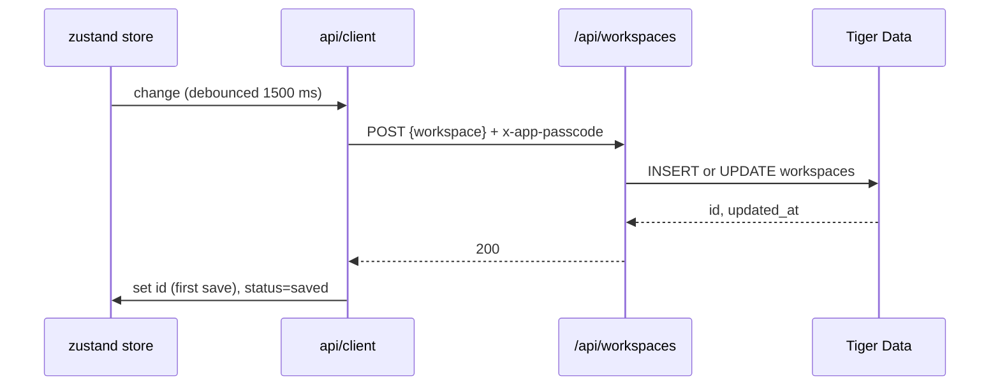
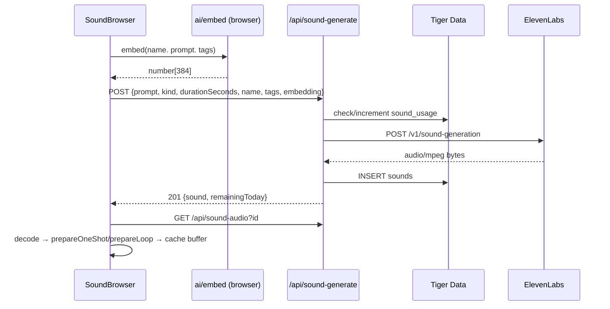
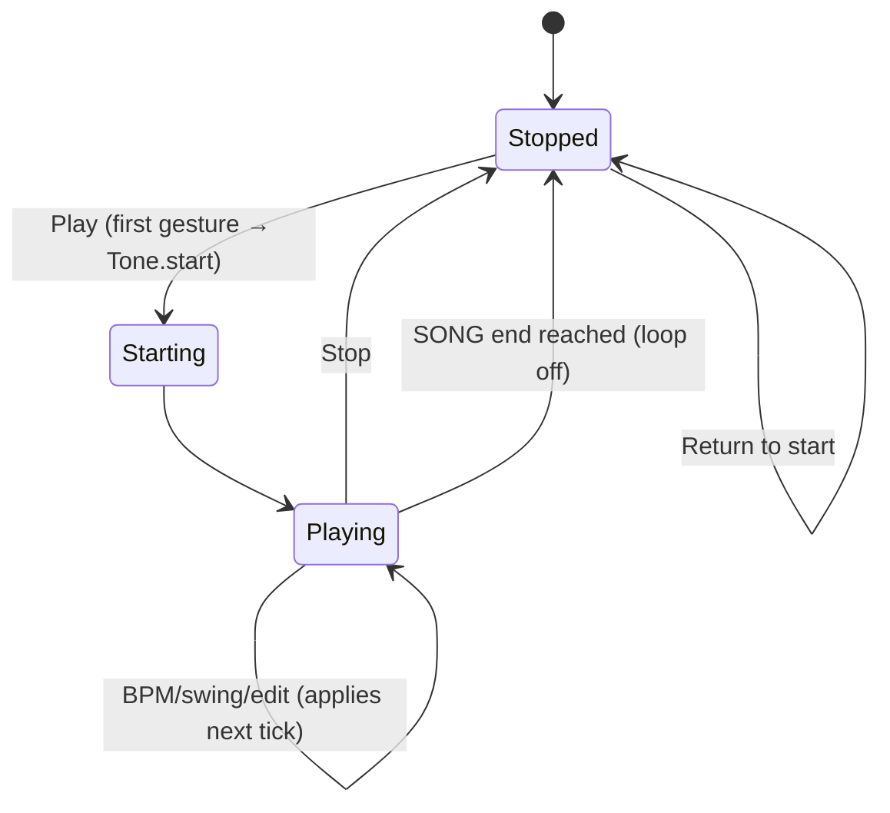
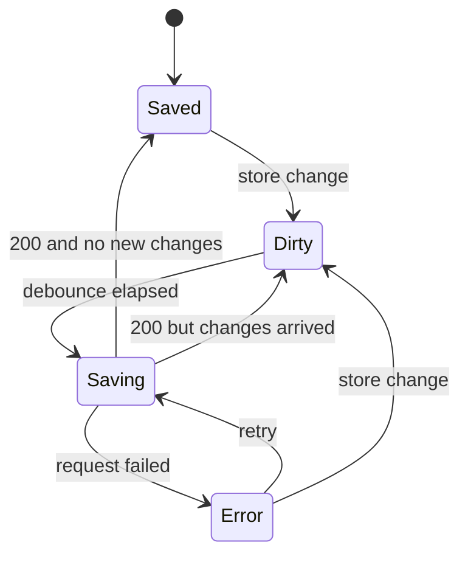

# PROCESS_FLOW.md — Krisp

## PURPOSE

Defines how Krisp behaves over time: user journeys step by step, system flows between browser, `/api`, Tiger Data and ElevenLabs, and the state machines for transport, saving, sound creation, uploads and AI model loading.
Concepts and features: `docs/PRD.md`. Contracts and modules: `docs/TRD.md`. Screens and components: `docs/UI_DESIGN.md`.

## CONTEXT

- Everything musical (editing, playback, mixing, AI, export) happens in the browser and never waits on the network.
- The network is used for: loading/saving Workspaces, listing/uploading/generating Sounds, fetching Sound audio, search.
- The passcode is required only for network actions.

## USER JOURNEYS

### J1 First run

1. Open app → Home (empty state: "No workspaces yet" + large **New workspace** button).
2. **New workspace** → dialog: name (default "Untitled beat"), start from **Empty** or a preset (8 preset cards with genre + BPM). Choose **Lo-fi**.
3. First network action (create) → PasscodeGate modal → enter passcode → stored for the session.
4. Workspace opens: Rack with default kit, Beat Editor showing the preset Beat, Song with the Beat placed on "Beats 1" for 4 bars, Play mode BEAT, BPM/swing from preset.
5. Press Space/Play → `Tone.start()` (first gesture) → beat plays. (M1: < 10 s.)

### J2 Build a beat by hand

1. Click pads to toggle; drag across a row to paint.
2. Shift+click an active pad to cycle velocity (100 → 127 → 40 → 80).
3. Toggle 16/32; clear a row from the row's clear button.
4. Adjust BPM (drag LCD / type / Tap) and Swing knob while playing; changes apply on the next tick.
5. Ctrl/Cmd+Z undoes any step.
6. SHOULD: Record on → keys A–K play Slots 1–8 and write to the nearest step.

### J3 Manage beats

1. Beat chips above the grid: click to select; **+** creates an empty Beat; context menu: Rename, Duplicate, Delete, Change color.
2. **Insert preset** → choose preset → new Beat chip (BPM/swing unchanged unless the Workspace is empty).
3. Deleting a Beat used in the Song → confirm "Also removes N clips".

### J4 Create a sound with ElevenLabs

1. Side panel → **Sounds** → **Create**.
2. Type a description; choose One-shot or Loop; choose duration; name and tags are pre-filled from the description (editable). The final prompt sent is shown under the field.
3. **Generate** → button shows progress LED → result row appears with preview.
4. **Use** → if opened from a Slot ("Replace sound"), assigns to that Slot; otherwise asks: assign to Slot (one-shot) or place on AUDIO lane at the playhead bar (loop).
5. Remaining generations today shown; at 0 the Generate button is disabled with a message.

### J5 Upload own sounds

1. **Sounds** → **Upload** → drop files or pick (WAV/MP3/OGG, ≤ 3 MB each, multiple allowed).
2. Each file is decoded locally; duration measured; kind suggested (≤ 2 s → One-shot); name from filename; tags editable.
3. **Save** → uploaded to the Library → **Use** as in J4 step 4.

### J6 Find a sound

1. **Sounds** → **Library** → type "warm dusty kick" → results with `vector` / `keyword` badges, preview, waveform.
2. Kind filter follows context: replacing a Slot sound → One-shot; placing on an AUDIO lane → Loop.

### J7 Arrange a tune

1. Drag a Beat chip onto a BEAT lane → clip at the drop bar, length = Beat length in bars.
2. Drag a Loop from the Library onto an AUDIO lane → clip with length = round(duration / barSeconds) bars (min 1). Mismatch > 5% shows a warning icon.
3. Move clips by dragging; resize by dragging the right edge (Beat clips repeat); Alt-drag or Ctrl/Cmd+D duplicates; Delete removes.
4. Add lanes with **+ Beat lane** / **+ Audio lane**.
5. Switch Play mode to SONG → Play. Drag on the ruler to set a loop region (SHOULD).

### J8 Mix and master

1. Press **M** → Mixer drawer slides up.
2. Per Channel: fader, pan, mute/solo, EQ knobs, reverb send. Meters move with audio.
3. Master: compressor (on, threshold, ratio, attack, release, GR LED), limiter (on, ceiling), reverb decay/return, master EQ, master fader.

### J9 AI on a beat

1. Side panel → **AI** tab. First use of a tool loads its model (LED amber → green).
2. **Humanize** → selected Beat gets human velocity/timing (pads show new brightness; tiny offset ticks on pads).
3. **Variations** → set Wildness → **Generate** → 4 mini-grids; hover to audition (plays the candidate in place while held); **Apply** or **Add as new beat**.
4. **Continue** (SHOULD) → bar 2 generated from bar 1.
5. **Morph** (SHOULD) → choose Beat A and Beat B → slider 1–9 swaps the audition → **Add as new beat**.
6. Any AI result can be undone.

### J10 Export

1. **Export** in the transport → dialog: WAV (Song or Loop region), MIDI (Selected Beat or Song).
2. WAV → offline render with progress → file download.
3. MIDI → instant download.

## SYSTEM FLOWS

### SF1 Autosave

Rules: one request in flight; changes during a request trigger one more save after it; failure → status `error`, retry with backoff 2 s, 5 s, 15 s, then wait for the next change.

### SF2 Generate sound

### SF3 Upload sound

Browser: validate type/size → `decode` → `durationMs` → `suggestKind` → user confirms → `embed` → base64 → `POST /api/sounds` → `INSERT` → `201 {sound}` → buffer cached from the already-decoded audio (no re-download).

### SF4 Search

Browser: `embed(query)` → `POST /api/search {q, embedding, kind?}` → hybrid SQL (TRD) → results with badges. Empty query → `GET /api/sounds?kind=` (newest first).

### SF5 Open workspace

`GET /api/workspaces?id` → load into store (clear history) → engine `ensureSlot` for each Slot and `ensureAudioLane` for each AUDIO lane → fetch and prepare buffers for all `sample` Slots and audio clips in parallel (Slots show a loading LED until ready; playback of a not-yet-loaded Slot is silent, never blocking).

### SF6 Playback tick

On each `16n` Transport tick: read latest store → compute triggers per TRD → schedule `engine.trigger(slotId, time, velocity)` → `Tone.Draw.schedule` playhead update. Audio clips play via synced Players created on start/seek.

## STATE MACHINES

### Transport

Switching Play mode while playing restarts from bar 1 of the new mode.

### Save status

LED: Saved = green, Dirty/Saving = amber, Error = red (tooltip with message).

### Sound generation request

`Idle → Embedding → Requesting → Preparing → Ready`; any step → `Failed` (message: daily limit / ElevenLabs error / network) → `Idle` on dismiss.

### Upload item

`Selected → Decoding → (Invalid | Ready) → Uploading → (Saved | Failed)`.

### AI model

`NotLoaded → Loading → Ready`; `Loading → Failed` (toast "Model failed to load"; tool button shows retry). Running a tool: `Ready → Running → Ready`; result pushed to undo history.

## ERROR HANDLING

| Situation | Behaviour |
|---|---|
| Wrong passcode (401) | Clear stored passcode, reopen PasscodeGate, retry once |
| Backend unreachable | Editing continues; save LED red; toast once per minute max |
| Sound audio fetch fails | Slot shows red LED + "Reload sound" action; other Slots unaffected |
| Upload too large / bad type | Inline error on that file row; nothing sent |
| ElevenLabs 429/5xx | Inline error in Create; no usage counted on failure |
| Magenta load failure | Toast; AI buttons show retry; manual features unaffected |
| Export failure | Dialog shows error with "Try again" |

## RELATED DOCUMENTS

`docs/PRD.md`, `docs/TRD.md`, `docs/UI_DESIGN.md`, `docs/MVP.md`.
