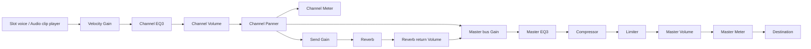

# TRD.md — Pocket

## PURPOSE

Defines HOW Pocket is implemented: stack, constraints, repository layout, configuration, data model, presets, database, API contracts, audio engine, scheduling, AI integration, sound analysis, export, security, performance, testing, and the register of details to verify.
Features (F1–F12) and concept names: `docs/PRD.md`. Priorities and acceptance criteria: `docs/MVP.md`. Runtime sequences and state machines: `docs/PROCESS_FLOW.md`. Visuals: `docs/UI_DESIGN.md`.

## CONTEXT

- Single-page web app + a few serverless functions. All sound creation, playback, mixing, AI inference and export run in the browser. The backend only stores Workspaces and Sounds, proxies ElevenLabs, and runs search queries.
- Hosting: Vercel Hobby (static `dist/` + `/api` Node functions). Database: Tiger Data (Postgres with pgvector).

## STACK

| Concern | Package / service | Notes |
|---|---|---|
| Build | `vite`, `typescript` | React plugin |
| UI | `react` 18, `react-dom`, `tailwindcss` | Theme via CSS variables (`docs/UI_DESIGN.md`) |
| State | `zustand` | One store for the open Workspace + undo history |
| Audio | `tone` | Transport, synths, players, EQ3, Compressor, Limiter, Reverb, Meter, Offline |
| Open-source AI | `@magenta/music` | Loaded with dynamic `import()`; UMD fallback (VERIFY-1) |
| Embeddings | `@huggingface/transformers` | Model `Xenova/all-MiniLM-L6-v2`, 384-d; dynamic `import()` |
| MIDI | `@tonejs/midi` | Export only |
| IDs | `crypto.randomUUID()` | Browser + Node |
| Backend | Vercel Node functions in `/api` (TypeScript) | `@vercel/node` types |
| DB client | `pg` | Pool `max: 1` per function instance |
| Tests | `vitest` | Pure-logic tests |
| External API | ElevenLabs Sound Effects | Server-side only |

Pin versions through `package-lock.json`. MUST NOT add other runtime dependencies without user approval.

## CONSTRAINTS

- 4/4 only; steps are 16th notes; Beat length 16 or 32 steps.
- BPM 60–200; swing 0–0.6; Song length 4–128 bars.
- Upload: WAV/MP3/OGG, raw file ≤ 3 MB, sent as base64 JSON (keeps the request under Vercel's 4.5 MB body limit without multipart parsing).
- Generated Sound duration: one-shot 0.5–2 s, loop up to the ElevenLabs maximum (VERIFY-3).
- No time-stretching. No microphone recording.
- Secrets only in `/api`. Frontend talks only to same-origin `/api/*`.
- AudioContext MUST start on a user gesture (`Tone.start()` on first Play/Preview click).

## REPOSITORY LAYOUT

```text
.
├── CLAUDE.md  AGENT.md  BUILD_PROMPTS.md  README.md
├── docs/ PRD.md MVP.md TRD.md PROCESS_FLOW.md UI_DESIGN.md TASKS.md SETUP.md SUBMISSION.md
├── .env.example  package.json  vite.config.ts  tailwind.config.ts  tsconfig.json  vercel.json (only if needed)
├── db/schema.sql
├── api/
│   ├── _lib/db.ts            # getPool(), query<T>()
│   ├── _lib/auth.ts          # requirePasscode(req,res): boolean
│   ├── _lib/http.ts          # json(), error(), readJson()
│   ├── workspaces.ts         # GET list|one, POST upsert, DELETE
│   ├── sounds.ts             # GET list, POST upload
│   ├── sound-generate.ts     # POST ElevenLabs
│   ├── sound-audio.ts        # GET bytes
│   └── search.ts             # POST hybrid search
├── src/
│   ├── main.tsx  App.tsx  router.tsx
│   ├── theme/tokens.css
│   ├── model/types.ts  model/defaults.ts  model/ids.ts
│   ├── presets/kit.ts  presets/beats.ts
│   ├── store/workspace.ts  store/history.ts  store/selectors.ts
│   ├── audio/
│   │   context.ts            # ensureAudioStarted()
│   │   engine.ts             # createEngine(ctx): Engine (graph + voices)
│   │   voices.ts             # SynthVoice, SampleVoice
│   │   scheduler.ts          # pure timing math + Transport binding
│   │   buffers.ts            # Sound id -> AudioBuffer cache
│   │   analyze.ts            # decode, trim, normalize, peaks, duration
│   │   export-wav.ts  export-midi.ts  wav-encoder.ts
│   ├── ai/magenta.ts  ai/convert.ts  ai/embed.ts
│   ├── api/client.ts
│   ├── ui/ Panel Knob Fader Pad LedButton Lcd Meter Toggle Chip Dialog Tooltip Tabs
│   └── screens/
│       Home.tsx  Workspace.tsx  KitDemo.tsx (dev only)
│       workspace/ TransportBar Rack SlotRow BeatEditor BeatChips Song LaneRow ClipView
│                  Mixer ChannelStrip MasterStrip SoundBrowser SoundRow AIPanel ExportDialog
│                  PasscodeGate ShortcutsOverlay
└── tests/
```

## CONFIGURATION

| Variable | Scope | Value |
|---|---|---|
| `TIGER_DATABASE_URL` | server | `postgres://tsdbadmin:<pw>@<host>:<port>/tsdb?sslmode=require` |
| `ELEVENLABS_API_KEY` | server | ElevenLabs key |
| `APP_PASSCODE` | server | Shared passcode |
| `DAILY_SOUND_LIMIT` | server | Integer, default `40` |

## DATA MODEL (`src/model/types.ts`)

```ts
export type Id = string;
export type SynthPreset = 'kick'|'snare'|'clap'|'chh'|'ohh'|'tom'|'rim'|'crash';
export type SlotSound = { kind: 'synth'; preset: SynthPreset } | { kind: 'sample'; soundId: Id; name: string };
export type DrumPitch = 36|38|42|46|45|48|50|49|51;   // Magenta drum pitch classes

export interface Slot { id: Id; name: string; color: string; sound: SlotSound; pitch: DrumPitch; tune: number; }
export interface Step { on: boolean; velocity: number; offset: number; }   // velocity 1..127, offset -0.5..0.5 step
export interface Beat { id: Id; name: string; color: string; length: 16|32; steps: Record<Id, Step[]>; }

export interface BeatClip  { id: Id; kind: 'beat';  laneId: Id; beatId: Id;  startBar: number; lengthBars: number; }
export interface AudioClip { id: Id; kind: 'audio'; laneId: Id; soundId: Id; soundName: string; durationMs: number; startBar: number; lengthBars: number; gainDb: number; }
export type Clip = BeatClip | AudioClip;
export interface Lane { id: Id; name: string; type: 'BEAT'|'AUDIO'; }

export interface EQ3 { low: number; mid: number; high: number; }
export interface Channel { volumeDb: number; pan: number; mute: boolean; solo: boolean; eq: EQ3; reverbSend: number; }
export interface Master {
  volumeDb: number; eq: EQ3;
  compressor: { enabled: boolean; threshold: number; ratio: number; attack: number; release: number };
  limiter: { enabled: boolean; ceiling: number };
  reverb: { decay: number; returnDb: number };
}

export interface Workspace {
  id: Id | null; name: string; version: 1;
  bpm: number; swing: number; songBars: number;
  loop: { enabled: boolean; startBar: number; endBar: number };
  metronome: boolean; playMode: 'BEAT'|'SONG';
  rack: Slot[]; beats: Beat[]; selectedBeatId: Id | null;
  lanes: Lane[]; clips: Clip[];
  mixer: { channels: Record<Id, Channel>; master: Master };   // key = slotId or AUDIO laneId
}
```

Rules:
- `Beat.steps` has an entry for every Slot id; missing entries are treated as all-off and created lazily.
- Removing a Slot removes its `steps` entries in all Beats and its Channel.
- Removing a Beat removes its Beat clips. Removing a Lane removes its clips (and its Channel for AUDIO lanes).
- `songBars = max(songBars, max(clip.startBar + clip.lengthBars))`. Bars are 0-indexed internally, 1-indexed in UI.
- Undo history stores whole `Workspace` snapshots (structural sharing via immutable updates); 100 entries; consecutive knob/fader drags are coalesced into one entry (commit on pointer-up).

### Defaults (`src/model/defaults.ts`)

Channel: `{ volumeDb: 0, pan: 0, mute: false, solo: false, eq: {low:0,mid:0,high:0}, reverbSend: 0 }`.
Master: `{ volumeDb: 0, eq: {0,0,0}, compressor: { enabled: true, threshold: -18, ratio: 3, attack: 0.01, release: 0.2 }, limiter: { enabled: true, ceiling: -1 }, reverb: { decay: 2.5, returnDb: -6 } }`.
New Workspace: bpm 90, swing 0, songBars 16, loop disabled (0–4), metronome off, playMode BEAT, default Rack, one empty 16-step Beat "Beat 1", lanes `[BEAT "Beats 1", AUDIO "Audio 1"]`, no clips.

Default Rack order (pitch, color): Kick (36, `#E4572E`), Snare (38, `#F3A712`), Clap (38, `#E9C46A`), Closed Hat (42, `#2A9D8F`), Open Hat (46, `#4FB3A9`), Tom (45, `#6C8EBF`), Rim (50, `#9B7EDE`), Crash (49, `#A8A29E`).
New Slots take the next pitch in `[36,38,42,46,45,48,50,49,51]` not yet used; if all used, 38.

## PRESETS

### Synth kit (`src/presets/kit.ts`)

| Preset | Tone.js recipe (starting values; tune by ear) | MIDI export note |
|---|---|---|
| kick | MembraneSynth { pitchDecay 0.05, octaves 6, envelope { attack 0.001, decay 0.4, sustain 0 } }, note C1 | 36 |
| snare | NoiseSynth white { decay 0.15, sustain 0 } + Synth triangle 180 Hz { decay 0.08 } | 38 |
| clap | NoiseSynth pink { decay 0.12 } triggered 3× at +0/+10/+20 ms, bandpass 1.2 kHz | 39 |
| chh | MetalSynth { frequency 400, envelope { decay 0.05 }, harmonicity 5.1, resonance 4000 } | 42 |
| ohh | MetalSynth same, decay 0.4 | 46 |
| tom | MembraneSynth { pitchDecay 0.03, octaves 2 }, note G2 | 45 |
| rim | Synth triangle 900 Hz { decay 0.03 } | 37 |
| crash | MetalSynth { decay 1.5, frequency 300 } | 49 |

Sample Slots export to the MIDI note of the Slot's `pitch` (36/38/42/46/45/48/50/49/51).

### Preset Beats (`src/presets/beats.ts`)

Encoding per row (16 chars = one bar of 16ths): `.` off, `g` 40, `s` 80, `x` 100, `X` 127. Rows map to default Rack by name; rows not listed are empty. All patterns are original to this project.

| Preset | BPM | Swing | Rows |
|---|---|---|---|
| Boom Bap | 90 | 0.15 | Kick `X.....x...x.....` · Snare `....X.......X...` · Closed Hat `x.s.x.s.x.s.x.s.` · Open Hat `..............x.` · Rim `.......g......g.` |
| Trap | 140 | 0 | Kick `X......x..x.....` · Snare `........X.......` · Clap `........x.......` · Closed Hat `x.x.x.x.xxx.x.xx` · Open Hat `......x.........` |
| House | 124 | 0 | Kick `X...X...X...X...` · Clap `....x.......x...` · Closed Hat `s...s...s...s...` · Open Hat `..x...x...x...x.` |
| Techno | 130 | 0 | Kick `X...X...X...X...` · Clap `....s.......s...` · Closed Hat `..x...x...x...x.` · Rim `......x.......x.` · Open Hat `..............s.` |
| Lo-fi | 80 | 0.30 | Kick `X......x.x......` · Snare `....x.......x..g` · Closed Hat `x.s.x.s.x.s.x.s.` · Rim `..........g.....` |
| Drill | 142 | 0 | Kick `X.......x.x.....` · Snare `........X.....x.` · Closed Hat `x..x..x.x..x..x.` · Tom `...........g..g.` |
| Reggaeton | 95 | 0 | Kick `X...X...X...X...` · Snare `...x..x....x..x.` · Closed Hat `x.x.x.x.x.x.x.x.` |
| Drum & Bass | 172 | 0 | Kick `X.........x.....` · Snare `....X.......X...` · Closed Hat `x.x.x.x.x.x.x.x.` · Rim `..g.....g....g..` |

A test MUST assert every row is exactly 16 characters of `.gsxX`.

## DATABASE (`db/schema.sql`)

```sql
CREATE EXTENSION IF NOT EXISTS vector;
CREATE EXTENSION IF NOT EXISTS pgcrypto;

CREATE TABLE IF NOT EXISTS workspaces (
  id uuid PRIMARY KEY DEFAULT gen_random_uuid(),
  name text NOT NULL,
  data jsonb NOT NULL,
  created_at timestamptz NOT NULL DEFAULT now(),
  updated_at timestamptz NOT NULL DEFAULT now()
);

CREATE TABLE IF NOT EXISTS sounds (
  id uuid PRIMARY KEY DEFAULT gen_random_uuid(),
  name text NOT NULL,
  kind text NOT NULL CHECK (kind IN ('ONE_SHOT','LOOP')),
  source text NOT NULL CHECK (source IN ('ELEVENLABS','UPLOAD')),
  prompt text,
  tags text[] NOT NULL DEFAULT '{}',
  mime text NOT NULL,
  duration_ms int NOT NULL,
  audio bytea NOT NULL,
  embedding vector(384) NOT NULL,
  tsv tsvector NOT NULL,   -- VERIFY-6 fallback applied; filled by every INSERT (see below)
  created_at timestamptz NOT NULL DEFAULT now()
);
CREATE INDEX IF NOT EXISTS sounds_embedding_idx ON sounds USING hnsw (embedding vector_cosine_ops);
CREATE INDEX IF NOT EXISTS sounds_tsv_idx ON sounds USING gin (tsv);
CREATE INDEX IF NOT EXISTS sounds_created_idx ON sounds (created_at DESC);

CREATE TABLE IF NOT EXISTS sound_usage (day date PRIMARY KEY, count int NOT NULL DEFAULT 0);
```

`tsv` is a plain column because Tiger rejected the generated-column version (VERIFY-6). Every INSERT into `sounds` (`api/sounds.ts`, `api/sound-generate.ts`) MUST set it with `to_tsvector('english', coalesce($name,'') || ' ' || coalesce($prompt,'') || ' ' || array_to_string($tags::text[],' '))`, using the same parameters as the `name`, `prompt`, `tags` columns.

### Hybrid search query (`api/search.ts`)

`$1` embedding literal `'[f1,f2,...]'`, `$2` query text, `$3` kind or NULL. Reciprocal rank fusion, k = 60:

```sql
WITH v AS (
  SELECT id, row_number() OVER (ORDER BY embedding <=> $1::vector) AS r
  FROM sounds WHERE ($3::text IS NULL OR kind = $3)
  ORDER BY embedding <=> $1::vector LIMIT 50
), k AS (
  SELECT id, row_number() OVER (ORDER BY ts_rank(tsv, q) DESC) AS r
  FROM sounds, websearch_to_tsquery('english', $2) q
  WHERE tsv @@ q AND ($3::text IS NULL OR kind = $3)
  ORDER BY ts_rank(tsv, q) DESC LIMIT 50
)
SELECT s.id, s.name, s.kind, s.source, s.prompt, s.tags, s.duration_ms, s.created_at,
       coalesce(1.0/(60+v.r),0) + coalesce(1.0/(60+k.r),0) AS score,
       v.r IS NOT NULL AS vector_hit, k.r IS NOT NULL AS keyword_hit
FROM sounds s LEFT JOIN v ON v.id = s.id LEFT JOIN k ON k.id = s.id
WHERE v.id IS NOT NULL OR k.id IS NOT NULL
ORDER BY score DESC LIMIT 20;
```

## API CONTRACTS

Common: JSON in/out (except audio). Header `x-app-passcode` required on every route → else `401 {error:'unauthorized'}` (constant-time compare). Errors: `{ error: string, detail?: string }`. Max request body 4.5 MB.

`SoundMeta = { id, name, kind, source, prompt, tags, duration_ms, created_at }`.

| Route | Method | Request | Success response | Errors |
|---|---|---|---|---|
| `/api/workspaces` | GET | — | `200 { workspaces: [{id,name,updated_at,colors:string[]}] }` (`colors` = first 6 Beat colors) | — |
| `/api/workspaces?id=` | GET | — | `200 { workspace }` | 404 |
| `/api/workspaces` | POST | `{ workspace }` | `200 { id, updated_at }` (insert if `id` null; else update `name`, `data`, `updated_at`) | 400 invalid |
| `/api/workspaces?id=` | DELETE | — | `200 { ok: true }` | 404 |
| `/api/sounds?kind=&limit=` | GET | — | `200 { sounds: SoundMeta[] }` newest first, default limit 50, max 200 | — |
| `/api/sounds` | POST | `{ name, kind, tags: string[], mime, durationMs, audioBase64, embedding: number[384] }` | `201 { sound }` | 400 (mime not wav/mpeg/ogg, decoded size > 3 MB, embedding length ≠ 384) |
| `/api/sound-generate` | GET | — | `200 { remainingToday, limit }` (added 2026-10-03 so the Create tab can show the counter before generating, J4 step 5) | — |
| `/api/sound-generate` | POST | `{ prompt, kind, durationSeconds, name, tags, embedding }` | `201 { sound, remainingToday }` | 400, 429 `daily_limit`, 502 `elevenlabs_error` |
| `/api/sound-audio?id=` | GET | — | `200` bytes, `Content-Type` = stored mime, `Cache-Control: public, max-age=31536000, immutable` | 404 |
| `/api/search` | POST | `{ q, embedding, kind?: 'ONE_SHOT'\|'LOOP' }` | `200 { results: (SoundMeta & {score, vector_hit, keyword_hit})[] }` | 400 |

### `/api/sound-generate` steps

1. Validate input (prompt 3–300 chars; one-shot 0.5–2 s; loop ≤ VERIFY-3 max).
2. `INSERT INTO sound_usage (day,count) VALUES (current_date,0) ON CONFLICT DO NOTHING`; read count; if `≥ DAILY_SOUND_LIMIT` → 429.
3. Call ElevenLabs: `POST https://api.elevenlabs.io/v1/sound-generation`, header `xi-api-key`, body `{ text: prompt, duration_seconds, prompt_influence: 0.5 }` → `audio/mpeg` bytes (VERIFY-3: path, fields, limits, output format, loop option).
4. Insert Sound (`source='ELEVENLABS'`, `mime='audio/mpeg'`, `duration_ms = durationSeconds*1000`, embedding from request); `UPDATE sound_usage SET count = count + 1`.
5. Return meta + `remainingToday`.

Prompt shaping is done in the frontend and shown to the user:
- ONE_SHOT: `"<text>, single drum one-shot, isolated, dry, no music"`
- LOOP: `"<text>, seamless drum loop, <bpm> bpm"`

Embedding text for any Sound: `` `${name}. ${prompt ?? ''}. ${tags.join(' ')}` ``.

### `api/_lib/db.ts`

`new Pool({ connectionString: process.env.TIGER_DATABASE_URL, max: 1, idleTimeoutMillis: 10000 })` cached on `globalThis`. TLS handling with `sslmode=require` in node-postgres: VERIFY-5. Vectors are passed as string literals `'[' + arr.join(',') + ']'`.

## AUDIO ENGINE (`src/audio/engine.ts`)

`createEngine(context: BaseContext): Engine` MUST work with both the live context and an offline context (export reuses it).

### Graph



- Channel mute/solo: effective gain = 0 when `mute`, or when any channel is soloed and this one is not. Implement on the Channel Volume node (`mute` property) to avoid clicks.
- Disabled compressor: threshold 0, ratio 1. Disabled limiter: threshold 0. (No rewiring during playback.)
- Parameter changes use `rampTo(value, 0.02)`.
- Metronome: a short Synth routed directly to Master Volume (bypasses mixer).
- `Engine` API: `ensureSlot(slot)`, `removeSlot(id)`, `ensureAudioLane(id)`, `removeAudioLane(id)`, `applyChannel(id, channel)`, `applyMaster(master)`, `trigger(slotId, time, velocity)`, `preview(slotId)`, `meters(): Record<Id|'master', number>`, `dispose()`.

### Voices (`src/audio/voices.ts`)

- `SynthVoice`: per preset recipe; `trigger(time, velocity, tune)` → `triggerAttackRelease(note transposed by tune, '16n', time, velocity/127)`.
- `SampleVoice`: holds the decoded/trimmed `AudioBuffer`; each trigger creates a `Tone.ToneBufferSource` (one-shot, allows overlapping hits) with `playbackRate = 2^(tune/12)` and a per-hit gain = velocity/127, connected to the Slot's Velocity Gain input.
- Buffers come from `buffers.ts` cache (fetch `/api/sound-audio?id=` → `analyze.prepareOneShot` or `prepareLoop`).

## SCHEDULING (`src/audio/scheduler.ts`)

Pure functions (unit-tested) + one Transport binding.

- `stepSeconds = 60 / bpm / 4`; `barSeconds = 16 * stepSeconds`.
- `swingDelay(stepIndex) = stepIndex % 2 === 1 ? swing * stepSeconds / 2 : 0`.
- `hitTime(tickTime, stepIndex, step) = tickTime + swingDelay(stepIndex) + step.offset * stepSeconds` (clamped ≥ tickTime − 0.4·stepSeconds).
- `Tone.getContext().lookAhead = 0.1`.
- Binding: `Transport.scheduleRepeat(onTick, '16n')`. A global tick counter `t` (reset on start/seek). `bar = floor(t / 16)`, `s = t % 16`.
  - BEAT mode: `i = t % beat.length`; trigger active steps of the selected Beat at index `i`.
  - SONG mode: for each BEAT lane, find the clip with `startBar ≤ bar < startBar + lengthBars`; `i = ((bar − startBar) * 16 + s) % beat.length`; trigger. Stop at `songBars` unless loop enabled.
  - Loop region: `Transport.loop = true; loopStart = startBar bars; loopEnd = endBar bars`; tick counter derives from `Transport.position` on loop wrap.
- Audio clips (SONG mode only): on start/seek and when clips change while stopped, create one `Tone.Player(buffer)` per audio clip, `.sync().start(startBar*barSeconds).stop((startBar+lengthBars)*barSeconds)`, connected to the AUDIO lane's Channel. Changes during playback are applied at the next bar boundary.
- UI updates (playhead, pad flash) via `Tone.Draw.schedule(cb, time)`; never set React state per tick for every pad—publish `currentStep` to a lightweight external store subscribed by the grid.
- The scheduler reads the latest Workspace from the zustand store on every tick (no restart needed after edits).

## AI INTEGRATION (`src/ai/`)

- Load `@magenta/music` lazily on first AI use. If import/build fails, load the UMD bundle from jsDelivr with a `<script>` tag and use global `mm` (VERIFY-1).
- Checkpoints (VERIFY-2 exact names): base `https://storage.googleapis.com/magentadata/js/checkpoints/`
  - Variations / Morph: `music_vae/drums_2bar_lokl_small`
  - Humanize: `music_vae/groovae_2bar_humanize`
  - Continue: `music_rnn/drum_kit_rnn`
- Model instances are cached; initialization shows a loading LED; failures show an error toast and leave the Beat unchanged.

### Conversion (`ai/convert.ts`)

- `beatToNoteSequence(beat, rack)`: quantized sequence, `stepsPerQuarter = 4`, `totalQuantizedSteps = 32` (16-step Beats duplicated), tempo = Workspace BPM; one note per active step: `{ pitch: slot.pitch, velocity, quantizedStartStep: i, quantizedEndStep: i+1, isDrum: true }`.
- `noteSequenceToBeat(seq, beat, rack, opts)`: build a new `steps` map; each note goes to the first Slot whose `pitch` equals the note pitch (else nearest pitch class in the list order); quantized notes set `on`, `velocity` (default 100); unquantized notes (GrooVAE output) set `offset = (startTime − stepIndex·stepSeconds) / stepSeconds` clamped to ±0.5. Slots with a pitch absent from the model's output keep their original steps when `opts.preserveUnmapped` is true (default true).
- Humanize: encode current Beat with GrooVAE → decode → copy only `velocity` and `offset` onto steps that are already `on` (never change on/off).
- Variations: `MusicVAE.similar(seq, 4, similarity = 1 − wildness·0.6, temperature = 0.2 + wildness·0.8)` (VERIFY-2 method signature) → 4 Beats.
- Continue: seed = bar 1 (16 steps) → `MusicRNN.continueSequence(seed, 16, temperature 1.0)` → becomes bar 2; Beat length set to 32.
- Morph: `MusicVAE.interpolate([A, B], 9)` → 9 Beats; slider selects index; **Add as new beat** stores the selected one.
- 16-step Beats: AI output's second bar is dropped for Humanize; kept (Beat becomes 32) for Variations only if the user chooses "keep 2 bars".

### Embeddings (`ai/embed.ts`)

`pipeline('feature-extraction', 'Xenova/all-MiniLM-L6-v2')`, mean pooling + normalize, returns `number[384]` (VERIFY-4 option names in transformers.js v3). Loaded lazily on first Create/Upload/Search; cached.

## SOUND ANALYSIS (`src/audio/analyze.ts`)

- `decode(arrayBuffer) → AudioBuffer` (Web Audio `decodeAudioData`).
- `prepareOneShot(buf)`: trim leading/trailing samples below −45 dBFS (keep 2 ms pre-roll), 5 ms linear fade-in, 20 ms fade-out, peak-normalize to −1 dBFS.
- `prepareLoop(buf)`: peak-normalize to −1 dBFS only.
- `durationMs(buf)`; `peaks(buf, buckets = 200) → number[]` (max abs per bucket, for waveform canvas).
- `suggestKind(durationMs) = durationMs ≤ 2000 ? 'ONE_SHOT' : 'LOOP'`.
- Upload: validate type and size (≤ 3 MB) before decoding; reject undecodable files with a clear message.

## EXPORT

- `export-wav.ts`: `Tone.Offline(async (ctx) => { const engine = createEngine(ctx); …schedule the whole Song (or loop region) with the same scheduler math…; ctx.transport.start(); }, durationSeconds + 2, 2, 44100)` → `AudioBuffer` → `wav-encoder.ts` (16-bit PCM, interleaved stereo, RIFF header) → `Blob` download `<workspace>-<bpm>bpm.wav`. Show progress (indeterminate allowed). VERIFY-7: `Tone.Offline` callback signature and Transport access in Tone version used.
- `export-midi.ts`: `@tonejs/midi` → one track, channel 9 (GM drums); notes at `hitTime` positions (swing + offset applied); velocity `v/127`; duration one 16th; header tempo = bpm. Scope: selected Beat (repeated once) or whole Song Beat clips. Filename `<workspace>-<beat|song>-<bpm>bpm.mid`.

## FRONTEND API CLIENT (`src/api/client.ts`)

- Adds `x-app-passcode` from `sessionStorage['pocket.passcode']`. On 401 → clears it and opens PasscodeGate, then retries once.
- Autosave: debounce 1500 ms after the last store change; one request in flight; if a change arrives during a request, save again after it finishes. Status: `saved | saving | error` for the transport LED.

## SECURITY

- Passcode compared with `crypto.timingSafeEqual` on equal-length buffers.
- No CORS headers (same-origin only).
- Input validation on every route; parameterized SQL only.
- Never return or log env values; ElevenLabs error bodies are truncated to 300 chars in `detail`.
- `npm run build` followed by `grep -r "ELEVENLABS_API_KEY\|TIGER_DATABASE_URL\|APP_PASSCODE" dist/` MUST return nothing (CI script `scripts/check-secrets.sh`).

## PERFORMANCE

- Initial JS ≤ 600 KB gzip excluding lazily loaded Magenta and transformers.js chunks.
- Grid renders 8 × 32 pads without dropped frames during playback (playhead via external store + CSS class toggles, not full re-render).
- Workspace JSON stays small (no audio inside); Sounds are fetched by id and cached in memory.

## TESTING (`tests/`, vitest)

| Test | Asserts |
|---|---|
| presets.test | every preset row is 16 chars of `.gsxX`; every preset maps to existing default Slot names |
| store.test | add/remove Slot updates all Beats + Channels; delete Beat removes clips; undo/redo; drag coalescing |
| scheduler.test | stepSeconds/barSeconds; swing delays; SONG clip lookup and repeat index; loop wrap |
| convert.test | Beat → NoteSequence → Beat round-trip preserves steps for mapped pitches |
| wav.test | encoder produces valid RIFF header and correct length |
| analyze.test | trim/normalize on synthetic buffers; suggestKind threshold |
| api-auth.test | requirePasscode rejects missing/wrong passcode |

## VERIFY REGISTER

| ID | Item | How | Result |
|---|---|---|---|
| VERIFY-1 | `@magenta/music` works under Vite; else UMD from jsDelivr (global `mm`) | Smoke test task T1 | DONE (2026-10-03, @magenta/music 1.23.1, Vite 7): dynamic `import('@magenta/music/esm/music_vae')` and `'@magenta/music/esm/music_rnn'` work in dev (headless Chrome, `/dev/magenta`). Import these submodules, not the package root (root pulls in the player + Tone 14). UMD fallback (`dist/magentamusic.js`, global `mm`) kept in `src/ai/magenta.ts` but not needed. Load of drums VAE ~14 s headless (no GPU). |
| VERIFY-2 | Checkpoint names; `MusicVAE.similar`, `interpolate`, `encode/decode`, `MusicRNN.continueSequence` signatures; GrooVAE usage for humanize | Magenta.js docs / checkpoints list | DONE (2026-10-03, installed `.d.ts` + live run): all 3 checkpoint URLs return config.json (drums VAE = DrumsConverter 32 steps; groovae_2bar_humanize = GrooveConverter humanize:true 32 steps; drum_kit_rnn = DrumsOneHotConverter). Signatures: `similar(seq, numSamples, similarity, temperature?)`, `interpolate(seqs, numInterps, temperature?)`, `encode(seqs) → Tensor2D`, `decode(z, temperature?, controlArgs?, stepsPerQuarter?, qpm?)`, `sample(n, temperature?)`, `MusicRNN.continueSequence(seq, steps, temperature?)`. Output facts for `convert.ts`: VAE/RNN notes are quantized with `velocity` unset (reads 0 → use default 100); GrooVAE decode returns unquantized notes (`startTime`, velocity set, no `quantizedStartStep`) → step = `round(startTime / stepSeconds)`, offset = `startTime/stepSeconds − step`; GrooVAE ignores input velocity/offset when humanize:true; `continueSequence` returns only the new steps, numbered from 0 (shift by seed length). |
| VERIFY-3 | ElevenLabs sound-generation endpoint, body fields, duration limits, output format, loop support, free-plan restrictions | ElevenLabs API reference | DONE (2026-10-03, elevenlabs.io/docs/api-reference/text-to-sound-effects/convert + /docs/capabilities/sound-effects): `POST https://api.elevenlabs.io/v1/sound-generation`, header `xi-api-key`. Body: `text` (required), `duration_seconds` 0.5–30 (null = auto), `prompt_influence` 0–1 (default 0.3), `loop` boolean (default false; v2 model only), `model_id` default `eleven_text_to_sound_v2`. Query `output_format` (e.g. `mp3_44100_128`); Pocket sends it explicitly so the stored mime is `audio/mpeg`. Max 30 s per generation. Cost: 40 credits per second when duration is set. Pocket: ONE_SHOT 0.5–2 s, LOOP 1–30 s with `loop: true`. Free-plan/commercial terms: not stated in these pages (UNKNOWN). |
| VERIFY-4 | transformers.js v3 `pipeline` options for mean pooling + normalize; model id availability | transformers.js docs | DONE (2026-10-03, installed @huggingface/transformers 3.8.1 `types/pipelines.d.ts`): `pipeline('feature-extraction', 'Xenova/all-MiniLM-L6-v2')` then `extractor(text, { pooling: 'mean', normalize: true })` → Tensor (dims [1, 384]; `.data` Float32Array). Model files on the Hub return 200 (`config.json`, `onnx/model_quantized.onnx`). |
| VERIFY-5 | node-postgres TLS with Tiger `sslmode=require` | Connect test from `vercel dev` | DONE (2026-10-03, pg 8.23.1): pg treats URL `sslmode=require` as `verify-full`, and URL ssl params override the `ssl` option. The Tiger service kept presenting a cert signed by Tiger's private root `O=Timescale Inc, CN=ca.timescale.com` (still >1 h after creation, although Tiger docs say a Google/ZeroSSL cert "usually" arrives within 30 min) → `SELF_SIGNED_CERT_IN_CHAIN`. Fix in `api/_lib/db.ts` `poolConfig()`: strip `sslmode` from the URL, `ssl: { ca: [...tls.rootCertificates, TIGER_ROOT_CA], rejectUnauthorized: true }` (root in `api/_lib/tiger-ca.ts`, valid to 2027-10-20). Full verification stays on; works with either cert. Confirmed: TLSv1.3, `GET /api/workspaces` → `200 {"workspaces":[]}` via `vercel dev`. MUST NOT use `rejectUnauthorized:false`. |
| VERIFY-6 | Generated column with `array_to_string` accepted | Run schema in Tiger SQL editor | REJECTED (2026-10-03): Tiger SQL editor → "generation expression is not immutable". Fallback applied: `tsv tsvector NOT NULL` filled by each INSERT (see DATABASE). Fallback schema ran cleanly; confirmed tables `workspaces`, `sounds`, `sound_usage`, extensions vector 0.8.6 + pgcrypto 1.4, 4 indexes on `sounds`. |
| VERIFY-7 | `Tone.Offline` signature and Transport inside offline rendering for the installed Tone version | Tone.js docs | TODO |

## RELATED DOCUMENTS

`docs/PRD.md`, `docs/MVP.md`, `docs/PROCESS_FLOW.md`, `docs/UI_DESIGN.md`, `docs/TASKS.md`.
